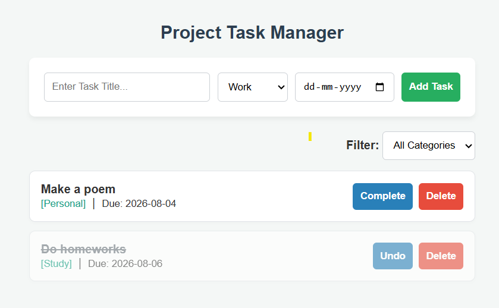

# 📝 Project Task Manager (FS07P1A)

A robust, backend-driven To-Do List application built with **Node.js**, **Express**, and **MongoDB**. This project strictly follows the **Model-View-Controller (MVC)** architectural pattern and uses **Server-Side Rendering (SSR)** via EJS — fulfilling the requirement of performing database operations without building a standard REST API.


---

---

## 📸 Preview



The app provides a clean, card-based interface for managing tasks — add a title, assign a category, pick a due date, and track progress at a glance.

---

## ✨ Features

- **Strict MVC Architecture** — clean separation of business logic (Controllers), data modeling (Models), and UI (Views).

- **Server-Side Rendering (SSR)** — fast, backend-driven UI generation using EJS templates, no client-side framework required.
  
- **Task Creation Form** — add a task with a title, category (Work / Study / Personal), and a due date via a native date picker.
  
- **Dynamic Category Filtering** — instantly filter tasks by category using the **Filter: All Categories** dropdown, backed by optimized MongoDB queries.
  
- **Complete / Undo Toggle** — mark a task as done (shown with a strikethrough and greyed-out styling) and reverse it with a single click if marked by mistake.
  
- **One-Click Delete** — remove tasks permanently from the list and database.
  
- **Color-Coded Category Tags** — each task displays its category (`[Work]`, `[Study]`, `[Personal]`) in a distinct color for quick scanning.
  
- **Intelligent Deadline Alerts** — algorithmic date-checking automatically flags overdue tasks in **red** and tasks due today in **orange**.
  
- **Cloud Deployed** — fully provisioned and hosted on an Amazon Web Services (AWS) EC2 instance, kept alive with PM2 process management.

---

## 🛠️ Technology Stack

| Layer          | Technology              |
|----------------|--------------------------|
| Backend        | Node.js, Express.js      |
| Database       | MongoDB, Mongoose (ODM)  |
| View Engine    | EJS (Embedded JavaScript)|
| Infrastructure | AWS EC2 (Ubuntu), PM2    |

---

## 📂 Folder Structure

```text
📦 todo-app
 ┣ 📂 controllers
 ┃ ┗ 📜 taskController.js    # Business logic and MongoDB queries
 ┣ 📂 models
 ┃ ┗ 📜 Task.js              # Mongoose schema definition
 ┣ 📂 routes
 ┃ ┗ 📜 taskRoutes.js        # Express routing
 ┣ 📂 views
 ┃ ┗ 📜 index.ejs            # Frontend UI template
 ┣ 📜 server.js              # Application entry point
 ┗ 📜 package.json
```

---

## 💻 Local Installation & Setup

**1. Clone the repository:**
```bash
git clone https://github.com/RahulBiswas224/fs07p1a__TaskManager.git
cd fs07p1a__TaskManager
```

**2. Install dependencies:**
```bash
npm install
```

**3. Start the database:**
Ensure MongoDB is installed and running locally on port `27017`.

**4. Run the server:**
```bash
npm start
```

The application will be running at `http://localhost:3000`.

---

## ☁️ AWS EC2 Deployment Guide

This application is configured for cloud deployment.

1. Provision an Ubuntu `t2.micro` instance on AWS EC2.
2. Configure Security Groups to allow inbound TCP traffic on port `3000`.
3. SSH into the instance and install Node.js and MongoDB.
4. Clone this repository and run `npm install`.
5. Use a process manager like PM2 (`pm2 start server.js`) to keep the application running continuously in the background.

---

## 📌 Roadmap / Future Improvements

- [ ] User authentication (per-user task lists)
- [ ] Edit-in-place for existing tasks
- [ ] Sort by due date / priority
- [ ] Email or push reminders for upcoming deadlines

---

## 👨‍💻 Author

**Project Code:** FS07P1A (Rixi Lab Technologies)

**Developed By:** BWU/BCA/23/224

Bachelor of Computer Applications, Brainware University

Specializing in Cloud Computing, DevOps, and AWS Architecture
